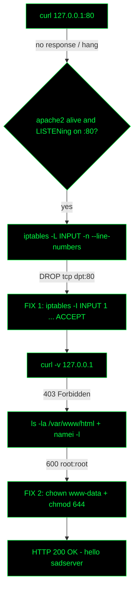

<div align="center">


<a href="https://github.com/FabianCH20">
  
</a>

<br/>


</div>

---

## `> cat ./mission.txt`

```bash
krikox@matrix:~$ cat mission.txt
```

A web server is serving `/var/www/html/index.html` with the content `hello sadserver`, but when checking it locally with `curl 127.0.0.1:80` **nothing is returned**.

> This scenario has nothing to do with the web server's specific configuration. Only general knowledge of how a web server works is needed (process → port → firewall → file permissions).

| | |
|---|---|
| **Goal** | `curl 127.0.0.1:80` returns `hello sadserver` (HTTP `200`) |
| **Initial symptom** | `curl` hangs / no response |
| **Root cause #1** | `iptables` rule `DROP tcp dpt:80` in the `INPUT` chain |
| **Root cause #2** | `index.html` has `600 root:root` permissions → Apache (`www-data`) gets `403` |
| **Estimated time** | ~5 min |

---

## `> ./attack_tree.sh`  (mental map)



---

## `> ./triage.sh`  (potential causes)

| # | Hypothesis | How to rule out / confirm | Result |
|:-:|---|---|:-:|
| 1 | Web server is not running | `systemctl status apache2` · `ss -tlnp \| grep :80` | ruled out |
| 2 | **Firewall blocking port 80** | `sudo iptables -L INPUT -n --line-numbers` | **CONFIRMED** |
| 3 | **Incorrect file permissions** | `ls -la /var/www/html` · Apache error.log | **CONFIRMED** |
| 4 | Web server misconfigured | `apache2ctl configtest` | ruled out |

---

## `> ./runbook.sh`  (step by step)

> Format: **command → symptom → fix**

### `[STEP 0]` Reproduce the problem

```bash
krikox@matrix:~$ curl -m 5 -v 127.0.0.1:80
```

**Symptom:** stuck at `Trying 127.0.0.1:80...` and ends in a timeout, no response.

> Quick diagnosis: a `DROP` **hangs** the connection (timeout). A `REJECT` would answer *Connection refused*. A stopped service would also give *Connection refused*. A hang points straight at the firewall.

---

### `[STEP 1]` Rule out a stopped service

```bash
krikox@matrix:~$ sudo systemctl status apache2
krikox@matrix:~$ sudo ss -tlnp | grep ':80'
```

**Expected symptom:** `active (running)` and `LISTEN ... *:80 ... apache2`.
**Fix:** none, the service is fine. Move on to the firewall.

---

### `[STEP 2]` Review the firewall rules

```bash
krikox@matrix:~$ sudo iptables -L
```

```text
Chain INPUT (policy ACCEPT)
target     prot opt source               destination
DROP       tcp  --  anywhere             anywhere             tcp dpt:http

Chain FORWARD (policy ACCEPT)
target     prot opt source               destination
```

**Symptom:** `DROP tcp ... dpt:http` in `INPUT` → **root cause #1**. All inbound traffic to port 80 is discarded before it reaches Apache.

---

### `[STEP 3]` Allow traffic to port 80

<table>
<tr>
<td width="50%">

**Wrong** (`-A` = append, goes to the end)

```bash
sudo iptables -A INPUT -p tcp --dport 80 -j ACCEPT
```

`iptables` evaluates rules **top to bottom**; the first match wins. If the `DROP` comes first, the `ACCEPT` is never reached.

</td>
<td width="50%">

**Right** (`-I INPUT 1` = insert at position 1)

```bash
sudo iptables -I INPUT 1 -p tcp --dport 80 -j ACCEPT
```

The rule lands **before** the `DROP` and takes effect immediately.

</td>
</tr>
</table>

Verify the order:

```bash
krikox@matrix:~$ sudo iptables -L INPUT --line-numbers
```

```text
Chain INPUT (policy ACCEPT)
num  target     prot opt source               destination
1    ACCEPT     tcp  --  anywhere             anywhere             tcp dpt:http
2    DROP       tcp  --  anywhere             anywhere             tcp dpt:http
```

**Expected symptom:** `ACCEPT` on line `1`, above the `DROP`.

<details>
<summary><b>Cleaner alternative: delete the DROP rule instead of covering it</b></summary>

<br/>

```bash
sudo iptables -D INPUT -p tcp --dport 80 -j DROP
```

Leaves the table free of contradictory rules. If you already ran `-A` before `-I`, you end up with duplicate rules; check with `--line-numbers` and remove the extra one with `iptables -D INPUT <num>`.

</details>

---

### `[STEP 4]` Test again

```bash
krikox@matrix:~$ curl -v 127.0.0.1:80
```

<details>
<summary><b>See full output (403 Forbidden)</b></summary>

```text
*   Trying 127.0.0.1:80...
* Connected to 127.0.0.1 (127.0.0.1) port 80 (#0)
> GET / HTTP/1.1
> Host: 127.0.0.1
> User-Agent: curl/7.81.0
> Accept: */*
>
* Mark bundle as not supporting multiuse
< HTTP/1.1 403 Forbidden
< Date: Thu, 18 Dec 2025 07:49:19 GMT
< Server: Apache/2.4.52 (Ubuntu)
< Content-Length: 274
< Content-Type: text/html; charset=iso-8859-1
<
<!DOCTYPE HTML PUBLIC "-//IETF//DTD HTML 2.0//EN">
<html><head>
<title>403 Forbidden</title>
</head><body>
<h1>Forbidden</h1>
<p>You don't have permission to access this resource.</p>
<hr>
<address>Apache/2.4.52 (Ubuntu) Server at 127.0.0.1 Port 80</address>
</body></html>
* Connection #0 to host 127.0.0.1 left intact
```

</details>

**Symptom:** it changed from *no response* to **`403 Forbidden`**. Progress: the firewall no longer blocks, Apache now reaches the file but cannot read it → **root cause #2** (permissions).

---

### `[STEP 5]` Diagnose permissions

```bash
krikox@matrix:~$ ls -la /var/www/html
```

```text
total 12
drwxr-xr-x 2 root root 4096 Aug  1  2022 .
drwxr-xr-x 3 root root 4096 Aug  1  2022 ..
-rw------- 1 root root   16 Aug  1  2022 index.html
```

**Symptom:** `index.html` is `-rw-------` (`600`), owner `root:root` → only `root` can read it. Apache runs as `www-data` on Ubuntu, hence the `403`.

Supporting commands to confirm it:

```bash
# Which user Apache runs as
ps -eo user,comm | grep apache2
grep -E 'APACHE_RUN_(USER|GROUP)' /etc/apache2/envvars

# Can the whole path down to the file be traversed?
namei -l /var/www/html/index.html

# Confirm the exact reason in the log
sudo tail -n 5 /var/log/apache2/error.log
```

> Log signature: `(13)Permission denied ... access to / denied`.

---

### `[STEP 6]` Fix owner and permissions

```bash
krikox@matrix:~$ sudo chown www-data:www-data /var/www/html/index.html
krikox@matrix:~$ sudo chmod 644 /var/www/html/index.html
```

**Fix:** owner `www-data:www-data` and mode `644` (`rw-r--r--`): owner reads/writes, everyone else read-only.

---

### `[STEP 7]` Final verification

```bash
krikox@matrix:~$ curl -v 127.0.0.1:80
```

```text
*   Trying 127.0.0.1:80...
* Connected to 127.0.0.1 (127.0.0.1) port 80 (#0)
> GET / HTTP/1.1
> Host: 127.0.0.1
> User-Agent: curl/7.81.0
> Accept: */*
>
* Mark bundle as not supporting multiuse
< HTTP/1.1 200 OK
< Date: Thu, 18 Dec 2025 07:52:04 GMT
< Server: Apache/2.4.52 (Ubuntu)
< Last-Modified: Mon, 01 Aug 2022 00:40:24 GMT
< ETag: "10-5e5233ed9edbf"
< Accept-Ranges: bytes
< Content-Length: 16
< Content-Type: text/html
<
hello sadserver
* Connection #0 to host 127.0.0.1 left intact
```

**Result:** `HTTP/1.1 200 OK` + body `hello sadserver`. Lab solved.

---

## `> ./cheatsheet.sh`  (symptom → cause → fix)

| `curl` symptom | Likely cause | Confirm with | Fix |
|---|---|---|---|
| Hangs / timeout | Firewall `DROP` | `iptables -L INPUT -n --line-numbers` | `iptables -I INPUT 1 -p tcp --dport 80 -j ACCEPT` |
| `Connection refused` | Service down or not listening | `systemctl status apache2` · `ss -tlnp` | `systemctl start apache2` |
| `403 Forbidden` | File permissions / owner | `ls -la` · `namei -l` · `error.log` | `chown www-data:www-data` + `chmod 644` |
| `404 Not Found` | Wrong path / `DocumentRoot` | `apache2ctl -S` | Fix path or vhost |
| `500 Internal Server Error` | Broken config / app | `apache2ctl configtest` · `error.log` | Fix config |

---

## `> ./lessons_learned.sh`

- **Timeout ≠ Refused.** `DROP` hangs the connection; `REJECT` or a stopped service return *refused*. It is the fastest hint that the firewall is the culprit.
- **Rule order in `iptables`.** Rules are evaluated top to bottom and the first match wins. `-A` appends to the end, `-I <chain> 1` inserts at the top.
- **A new error is progress.** Going from *no response* to `403` confirms one layer (network) is fixed and the next one (permissions) is showing.
- **Least privilege.** Web files: `644`, directories: `755`, with the right owner. Never `777`.
- **`iptables` changes do not persist** across a reboot. On a real server, save them with `iptables-save` / `netfilter-persistent save`.

---

## `> ./references.sh`

| Topic | Reference |
|---|---|
| Lab platform | [SadServers](https://sadservers.com/) |
| `iptables` (options `-A`, `-I`, `-D`, `-L`) | [iptables(8) man page](https://man7.org/linux/man-pages/man8/iptables.8.html) |
| Netfilter / iptables | [netfilter.org](https://www.netfilter.org/) |
| Permissions and security in Apache | [Apache HTTP Server 2.4: Security Tips](https://httpd.apache.org/docs/2.4/misc/security_tips.html) |
| Apache logs (`error.log`) | [Apache HTTP Server 2.4: Log Files](https://httpd.apache.org/docs/2.4/logs.html) |
| `403 Forbidden` status code | [MDN: 403 Forbidden](https://developer.mozilla.org/en-US/docs/Web/HTTP/Status/403) |
| Walking the permissions of a path | [namei(1) man page](https://man7.org/linux/man-pages/man1/namei.1.html) |
| `chmod` / `chown` | [chmod(1)](https://man7.org/linux/man-pages/man1/chmod.1.html) · [chown(1)](https://man7.org/linux/man-pages/man1/chown.1.html) |
| `curl` (flags `-v`, `-m`) | [curl man page](https://curl.se/docs/manpage.html) |

---

<div align="center">

```bash
krikox@matrix:~$ echo "Wake up, Neo..." && exit 0
```

<a href="https://github.com/FabianCH20">
  
</a>


</div>
